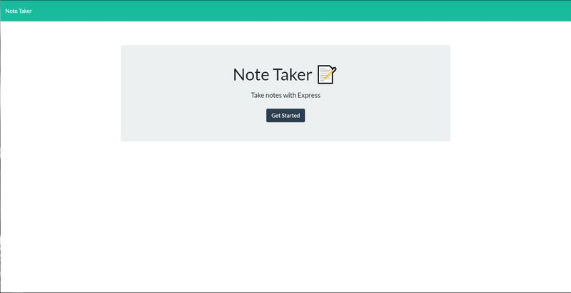
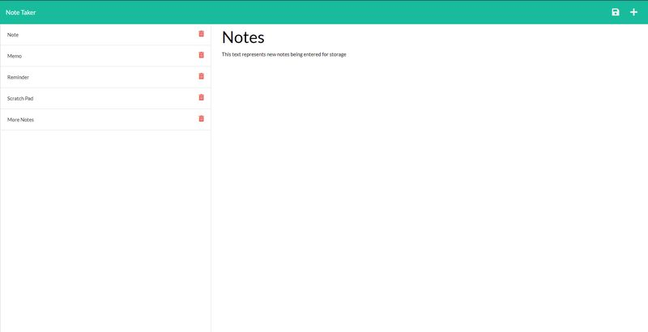

# Note Taker  

## Description  

This Node.js app using the Express package allows the user to enter and save notes under a heading for later use.  

## Table of Contents
- ### [Installation](#installation)
- ### [Usage](#usage)
- ### [Screenshots](#screenshots)
- ### [Contributing](#contributing)
- ### [Questions](#questions)
  

## Installation  

Simply install Node.js, open the terminal, run 'npm install' and then server.js from the directory command line. The local host version can then be accessed via browser at http://localhost:9001. Or just visit the link to the deployed app on Heroku in the [Usage](#usage) section below and sidestep installation altogether!  

## Usage  

Once the application is called by typing "node server.js" in the terminal, the user can load the app in their browser with the localhost:9001 address, click the 'Get Started' button, and just enter a title and text for their note and click the save button. The user may also delete any old or unwanted notes by clicking the trash buttons found on each stored note entry.

Check out the [deployed app](https://arcane-shelf-58681.herokuapp.com/) at Heroku.  

## Screenshots  

  

---  

  

## Contributing  

Neil Burt  

## Questions  

If you have any questions:  

Visit my [GitHub profile](https://github.com/neilburt).  

Or you can [email me](mailto:neil.burt@comcast.net).